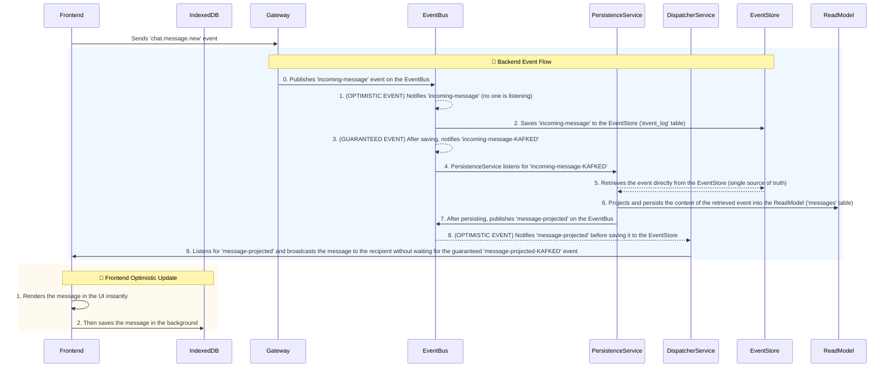

# Kafky-Event-Driven Chat

This project is a chat application built with Node.js to demonstrate an **Event-Driven Architecture (EDA)** in a simulated microservices environment. It implements patterns like **Event Sourcing** and **CQRS**, showcasing the decoupled interaction of microservices.

> 📘 **Este documento también está disponible en español:**  
> [Leer en español](README-es.md)

## Project Objective

The purpose is to serve as a practical and educational example for understanding key concepts of modern architectures:

*   ✅ **Centralized Event Bus**: An intermediary that decouples the system's components.
*   ✅ **Event Sourcing**: Each business action is captured as an immutable event in an **Event Store**. This is the single source of truth for the system.
*   ✅ **CQRS**: Write logic (commands that generate events) is separated from read logic (queries to projected models).
*   ✅ **Projections**: A service (`PersistenceService`) consumes events from the Event Store to build a data model optimized for queries.
*   ✅ **Smart Frontend**: Uses `IndexedDB` for instant history loading and `BroadcastChannel` to synchronize the chat session across multiple browser tabs.
*   ✅ **Optimistic Approach**: Both the backend and frontend prioritize response speed to improve the user experience.
  
## TO-DOs
*   **Error handling** with the Sagas pattern.
*   **Event schema validation** with `Ajv`.
*   **Centralized logging** in a dedicated service.

## Architecture at a Glance

The flow of a message, from the moment it is sent until it is received, follows this path, showcasing the interaction between the components and the persistence layers.



*Note: The EventBus intercepts published events and ALWAYS notifies with a **Double-Emit**:
**Eager Emit**: When the event is published (OPTIMISTIC EVENT)
**Kafked Emit**: After the event has been saved in the EventStore (GUARANTEED EVENT)

### ✨ Subscription Strategy: Speed vs. Reliability

Not all services require the same level of guarantee. This application uses different strategies to optimize performance and consistency:

| Service                | Subscribed Event            | Strategy        | Why?                                                                                                                                                   |
| :--------------------- | :-------------------------- | :-------------- | :----------------------------------------------------------------------------------------------------------------------------------------------------- |
| `PersistenceService`   | `incoming-message-KAFKED`   | **Guaranteed**  | Its job is to build the read model. It **CANNOT** act on an event that is not 100% confirmed in the **Event Store**.                                     |
| `DispatcherService`    | `message-projected`         | **Optimistic (Eager)** | It listens to `message-projected` directly. It prioritizes **speed** to improve UX and does so safely, as this event is only emitted **after** the guaranteed persistence has finished. |

#### The Same Philosophy on the Frontend
The `Frontend` (`main.js`) follows this same principle: when it receives a new message, it **first renders it on the screen** and **then tries to save it to `IndexedDB` in the background**. The priority is the fluidity of the conversation.

## Main Components

| File                   | Role                      | Key Responsibility                                                                   |
| :--------------------- | :------------------------ | :----------------------------------------------------------------------------------- |
| `server.js`            | **Gateway**               | Entry point. Translates WebSocket requests into domain events.                       |
| `event-bus.js`         | **Event Bus**             | Notifies of published events, persists them in the Event Store, and then provides the guaranteed emission. |
| `persistence-service.js` | **Projector**             | Listens to **guaranteed** events to build and update the read model.                 |
| `dispatcher.js`        | **Dispatcher**            | Listens to **optimistic** events to notify clients with minimal latency.             |
| `database.js`          | **Data Layer (Backend)**  | Simplified abstraction to interact with the database (which houses the Event Store and the ReadModel). |
| `public/main.js`       | **Frontend**              | Manages the UI, local persistence with `IndexedDB`, and tab synchronization with `BroadcastChannel`. |

## How to Run the Project

1.  **Install dependencies**:
    ```bash
    npm install
    ```

2.  **Set up the database**:
    ```bash
    node setup-db.js
    ```

3.  **Start the server**:
    ```bash
    node server.js
    ```

4.  **Open the application**:
    Open two browsers at `http://localhost:8000` and chat between two users.